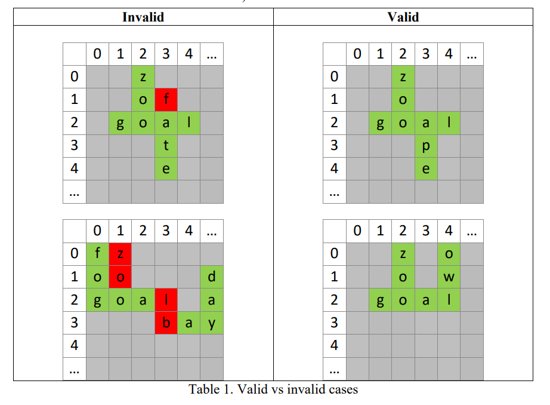
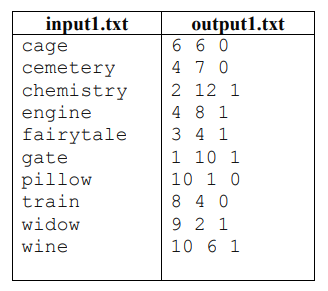
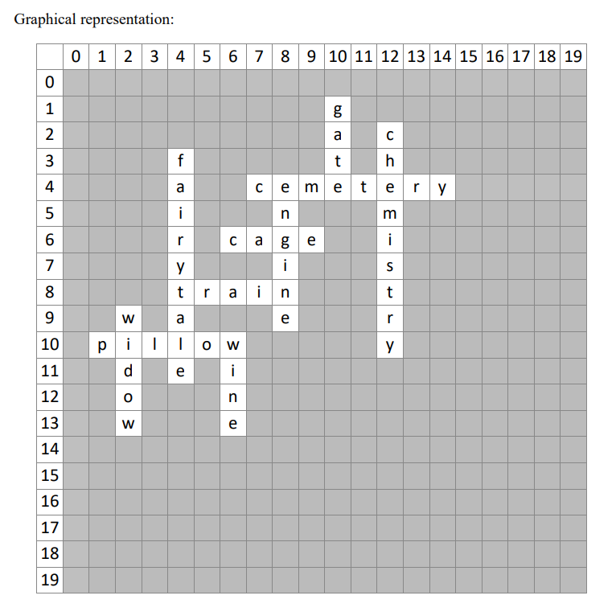

# Crossword Generation

## This was done as homework for Intro to AI course at Innopolis University.

### Task

You are given sequence of unique English lowercase words, all of which have to be
used for generation of a crossword. By using an evolutionary algorithm (EA), you have to
generate a crossword following several from the next section. You are allowed to use any type
of EA, however, you are obliged to use both crossover and mutation for evolving crosswords.

### Crossword Rules
1. Grid 20*20 has to be used
2. Words may contain only lowercase English words of length N ∈ [2; 20]. In
inputs we guarantee this
3. Words can be placed horizontally (left to right) or vertically (top down)
4. All words have to fit the row or column depending on orientation and words
can’t be cut
5. Each word has to be crossed by at least one another perpendicular word
6. Parallel horizontal/vertical words’ symbols shouldn’t be existing for neighbour
rows/columns. Exception is first or last word symbols (see Table 1)
7. No word or set of words can be separated from other words (the graph of all
letters has to be connected)

### Code
Your code is expected to be located in package assignment2/students. Violation of it
will lead to fine. Code should be safe and not interacting with other files other than inputs and
outputs. Not using the allowed language standard may lead to 0 for your work, because it may
be not compiling

### Report
Your report should deeply describe chosen EA algorithm, its flow, fitness function,
specifics of variation operators and EA parameters in plain English. Statistics demonstrating
the average and maximum population fitness should be provided. This has to be supported by
generated plots. You are supposed to use your own 100 tests to provide statistics.

### Evaluation
In the root with your code expect *inputs* directory with *M* inputs (*input1.txt* …
*inputM.txt*) for which you need to create outputs directory with corresponding *M* outputs
(*output1.txt*…*outputM.txt*). *M* is guaranteed to be not lower than 1. We will check all outputs
automatically and give points according to the percentage of passed tests. No partially passed
tests are expected. If your code gives an error on some test and other tests can’t be run, you
will have points only for passed tests. Pay attention to this. Each next test should not rely on
any other previous tests’ data.

### Inputs
The inputs are represented by *M* **.txt* files ending with a new line character. Each input
is containing Z ∈ [5; 20] words of length N ∈ [2; 20] separated by new lines. The inputs are
guaranteed to be giving at least 1 valid solution. The description of the input words’ meaning
is not provided and not needed for the task.

### Outputs
The outputs directory should be created by you and the number of outputs should match
the number of inputs. The outputs are represented by **.txt* files ending with a new line
character. Your code is able to produce different outputs for the same inputs, you may randomly
choose any solution, the only requirement is to follow the crossword rules. Even a tiny mistake
in output will result in 0 for the test.

The output should contain M lines, corresponding to each input word. Each line should
contain 3 integers:
1. Crossword’s row number X of the word’s first symbol (X ∈ [0; 19])
2. Crossword’s column number Y of the word’s first symbol (Y ∈ [0; 19])
3. Horizontal (0) or Vertical (1) location

The numeration starts from the top left corner.

### Example

